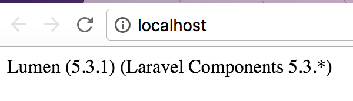

# luminod
### Docker + Lumen with Nginx, MySQL, and Memcached


---

## Docker Setup

### [Docker for Mac](https://docs.docker.com/docker-for-mac/)

### [Docker for Windows](https://docs.docker.com/docker-for-windows/)

### [Docker for Linux](https://docs.docker.com/engine/installation/linux/)

---

### Build & Run

```bash
git clone https://github.com/tjphippen/luminod && cd luminod && bash create.sh
```

`Have a beer!` :beer:

Navigate to [http://localhost:80](http://localhost:80) and you should see something like this


Success! You can now start developing your Lumen app on your host machine and you should see your changes on refresh! Classic PHP development cycle. A good place to start is `images/php/app/routes/web.php`.

Feel free to configure the default port 80 in `docker-compose.yml` to whatever you like.

### Stop Everything

```bash
docker-compose down
```

### Start Everything

```bash
docker-compose up --build -d
```

## Running Artisan commands

```sh
docker-compose exec php sh
# inside the container
cd ..
php artisan migrate
php artisan cache:clear
```

## Contribute
  - Submit a Pull Request!
  - Buy me a :beer: 
    - ETH: `0xe3b5b9db175d5988ac22e47979fdb639686069df` 
    - Paypal: `paypal@tjphippen.com`

## Dev To-Do:
1. bash prompts for .env vars(passwords)
2. generate app Key
3. Add Vue App container
4. Add SSL Cert
5. Add `rabbitmq` container
6. Add `bind` container

---

### Thanks To 
https://github.com/saada/docker-lumen
